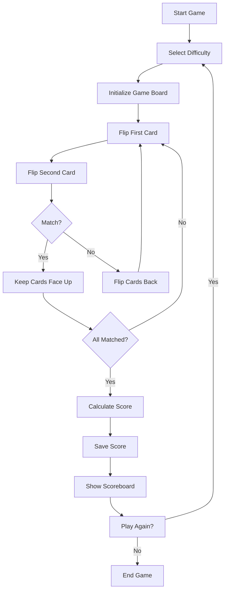

## 1. Product Overview
Memory Match is a classic card-matching game designed to test and improve memory skills for users of all ages.
- Provides an entertaining way to exercise cognitive abilities through gameplay
- Targets casual gamers looking for a quick, engaging mental challenge

## 2. Core Features

### 2.1 User Roles
| Role | Registration Method | Core Permissions |
|------|---------------------|------------------|
| Player | No registration required | Play game, view high scores |

### 2.2 Feature Module
1. **Game Page**: game board, timer, score counter, difficulty settings
2. **Scoreboard Page**: top scores, game statistics
3. **Instructions Page**: how to play, game rules

### 2.3 Page Details
| Page Name | Module Name | Feature description |
|-----------|-------------|---------------------|
| Game Page | Game Board | Display cards in grid layout, flip animation, match detection |
| Game Page | Timer | Track time elapsed during gameplay |
| Game Page | Score Counter | Calculate and display current score based on time and moves |
| Game Page | Difficulty Settings | Adjust game board size (easy, medium, hard) |
| Scoreboard Page | Top Scores | Display high scores for each difficulty level |
| Instructions Page | How to Play | Step-by-step guide with visual examples |

## 3. Core Process
1. Player selects difficulty level
2. Game initializes with shuffled cards
3. Player flips two cards per turn
4. If cards match, they remain face up
5. If cards don't match, they flip back face down
6. Game ends when all cards are matched
7. Player's score is calculated and saved to scoreboard

## 4. User Interface Design
### 4.1 Design Style
- Primary color: #4A6FA5 (deep blue)
- Secondary color: #FFD166 (warm yellow)
- Accent color: #06D6A0 (teal)
- Button style: rounded corners, subtle shadow
- Font: 'Poppins' (sans-serif), playful yet clean
- Layout style: centered game board, minimalistic design
- Icon style: simple, recognizable symbols for cards

### 4.2 Page Design Overview
| Page Name | Module Name | UI Elements |
|-----------|-------------|-------------|
| Game Page | Game Board | Grid layout with cards, flip animations, hover effects |
| Game Page | Controls | Difficulty selector, restart button, pause button |
| Scoreboard Page | Score List | Ranked scores with time and date, filter by difficulty |
| Instructions Page | Guide | Step-by-step instructions with illustrations, back button |

### 4.3 Responsiveness
- Desktop-first design with mobile adaptation
- Touch optimization for mobile devices
- Responsive grid layout that adjusts to screen size
- Card size scales based on device width

### 4.4 3D Scene Guidance
- Not applicable for this 2D memory game
