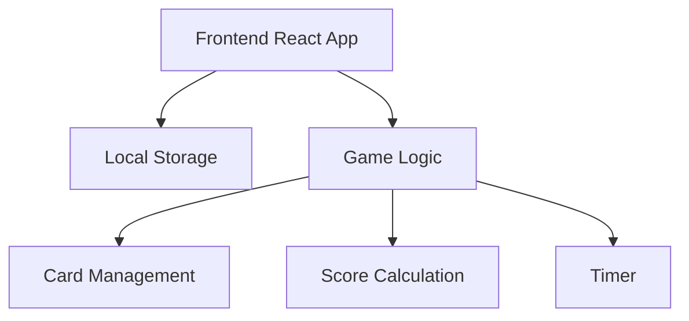
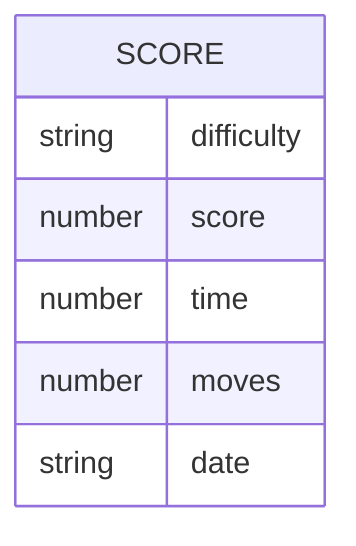

## 1. Architecture Design



## 2. Technology Description
- Frontend: React@18 + TailwindCSS@3 + Vite
- Initialization Tool: vite-init
- Backend: None (client-side only)
- Data Storage: Local Storage (for high scores)
- Additional Libraries: react-confetti (for victory celebration)

## 3. Route Definitions
| Route | Purpose |
|-------|---------|
| / | Home page with game start and instructions |
| /game | Game page with board and controls |
| /scoreboard | Scoreboard page with high scores |
| /instructions | Instructions page with game rules |

## 4. API Definitions
- No backend API required
- All game logic handled client-side

## 5. Server Architecture Diagram
- Not applicable (client-side only application)

## 6. Data Model
### 6.1 Data Model Definition



### 6.2 Data Definition Language
- No database required
- Data stored in Local Storage with the following structure:

```javascript
// Local Storage structure
{
  "memoryMatchScores": [
    {
      "difficulty": "easy",
      "score": 1200,
      "time": 30,
      "moves": 10,
      "date": "2023-04-01T12:00:00"
    },
    // more scores...
  ]
}
```

## 7. Component Structure
- App (main container with routing)
- HomePage (game start and navigation)
- GamePage (game board, timer, score)
- ScoreboardPage (high scores display)
- InstructionsPage (game rules)
- components/
  - Card (individual card component)
  - GameBoard (grid of cards)
  - ScoreCounter (score display)
  - Timer (game timer)
  - DifficultySelector (difficulty settings)
  - ScoreList (scoreboard display)

## 8. Game Logic Flow
1. Player selects difficulty level
2. Game initializes with shuffled cards based on difficulty
3. Timer starts when first card is flipped
4. Player flips two cards per turn
5. Game checks for matches
6. If match found, cards remain face up
7. If no match, cards flip back after short delay
8. Game ends when all cards are matched
9. Score is calculated based on time and moves
10. Score is saved to Local Storage
11. Player can view scoreboard or play again

## 9. Performance Considerations
- Card animations optimized with CSS transitions
- Game state managed with React useState and useCallback
- Local Storage operations batched to avoid excessive I/O
- Responsive design for different screen sizes
- Touch event support for mobile devices

## 10. Future Enhancements
- Multiplayer mode
- Custom card themes
- Sound effects
- More difficulty levels
- Online leaderboard (requires backend)
